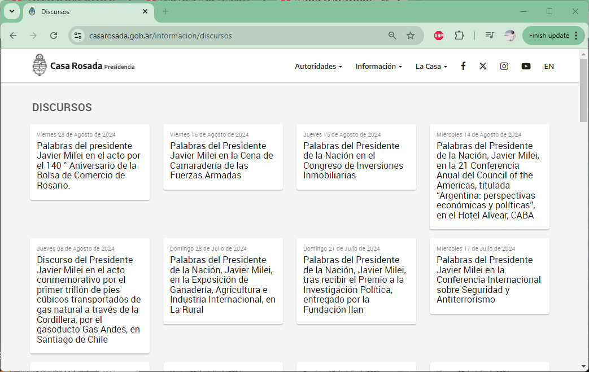
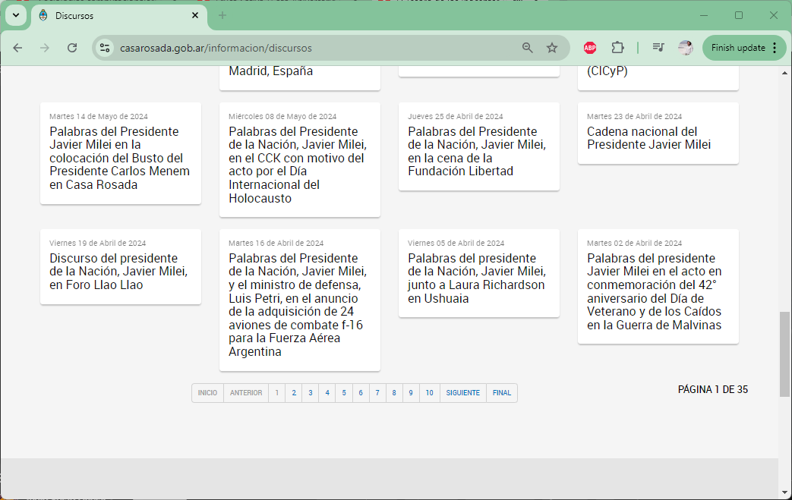
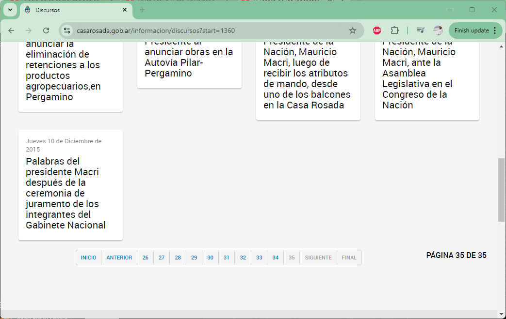
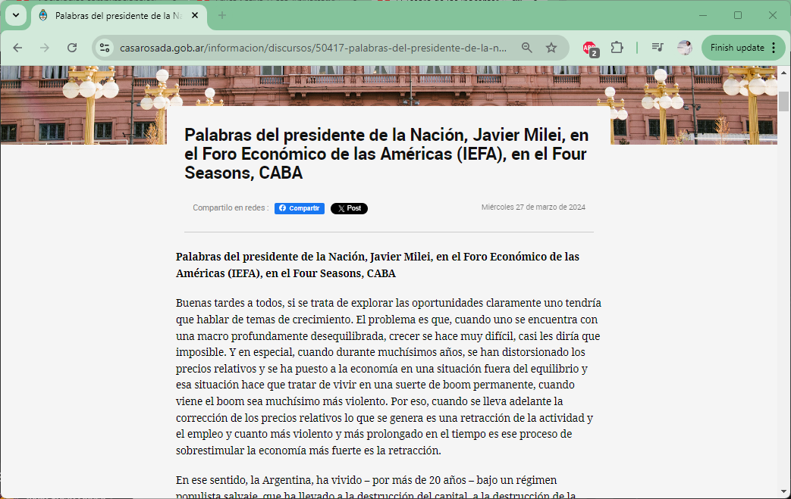
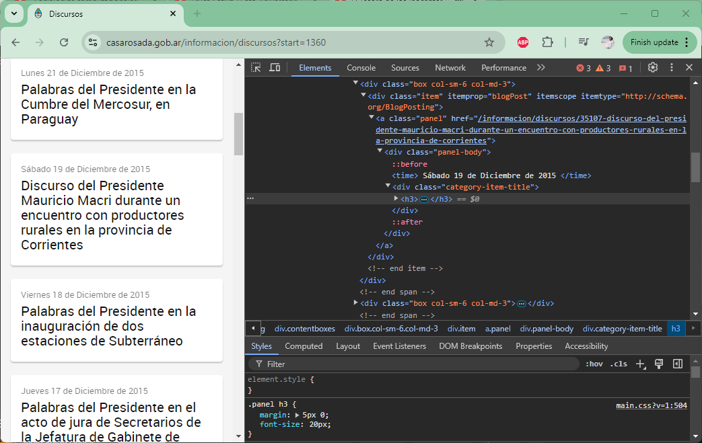
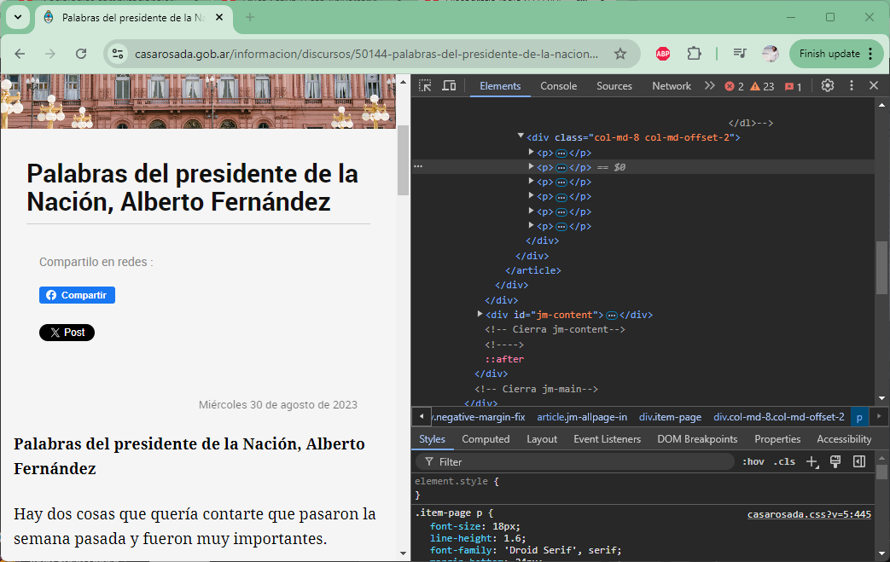

```{r setup, include=FALSE}
knitr::opts_chunk$set(echo = TRUE)
```

## Objetivo

Vamos a "scrapear" (recuperar) los discursos del sitio web de Casa Rosada

Empecemos por ver un poco el sitio:

Cuando ingresamos en <https://www.casarosada.gob.ar/informacion/discursos> vemos una página con un índice de discursos, donde sólo se indica la fecha y el título:



Una cuestión importante a considerar es que el sitio no muestra todos los discursos en la misma página sino que estos están paginados (hay 35 páginas al momento de hacer este tutorial). Podemos ver también que hay 40 discursos en cada página. Se avanza de página con una navegación ubicada al pie:



Cuando navegamos hacia la segunda página, podemos ver que la URL cambia hacia <https://www.casarosada.gob.ar/informacion/discursos?start=40.>

Como vemos la URL utiliza un parámetro (que identificamos por el símbolo **?** y el =), seguido de un valor numérico. Esto nos da la pauta de que la página utiliza un *template* para popular los discursos, y que tiene un *offset*, es decir, un parámetro que indica a partir de qué punto debe comenzar a mostrar los discursos: en el caso de la 2da página desde el discurso número 40; en la 3ra desde el discurso número 80, y asi hasta llegar al final de páginas.

Si vamos a la última pagina, vemos que la URL es <https://www.casarosada.gob.ar/informacion/discursos?start=1360>. Es decir, que el último valor de **?start=** es 1360.



Luego, para ver un discurso tenemos que hacer click en uno de estos títulos:



Notemos que la URL de los discursos siguen otro patrón: tienen como base <https://www.casarosada.gob.ar/informacion/discursos/> (a la base anterior se agregó **/discursos/**) y luego un identificador numérico y el título del discurso separado por "-". Por ejemplo:

-   <https://www.casarosada.gob.ar/informacion/discursos/50417-palabras-del-presidente-de-la-nacion-javier-milei-en-el-foro-economico-de-las-americas-iefa-en-el-four-seasons-caba>

-   <https://www.casarosada.gob.ar/informacion/discursos/50386-palabras-del-presidente-de-la-nacion-javier-milei-en-la-apertura-del-ciclo-lectivo-en-el-instituto-cardenal-copello-caba>

Si quisiéramos recuperar todos los discursos del sitio vamos a tener que ir a cada una de las páginas y tomar los links de cada discurso. Conviene entonces hacer el código en dos partes:

1) leer todas las páginas del índice de discursos, recuperando la URL de cada discurso

2) leer cada discurso en particular.

Comencemos!

## Preparemos el ambiente

Empecemos por setear las librerias:

```{r librerias, message=FALSE, warning=FALSE}

# si es la primera vez que corren codigo R seguro tengan que instalar librerias
# install.packages(c("tidyverse","foreach","rvest"))

library(tidyverse) # para uso general
library(rvest) # para recuperar contenido de la web
library(foreach) # para trabajar con bucles

```

## Parte 1) Hagamos un índice de discursos

Una posible manera de conseguir todos los links de los discursos sería hacer que nuestro código vaya recorriendo cada link en el paginador del pie de página. Pero dado que ya sabemos que cada uno de estos links lo único que modifica es el valor del *offset* (es decir, que solo cambia el valor de **?start=40, ?start=80...)**, podemos generar directamente de manera programática estos links.

```{r paginas, message=FALSE, warning=FALSE}

url_base_paginado <- "https://www.casarosada.gob.ar/informacion/discursos?start="

offset <- seq(from=0, to=1360, by=40) # secuencia de 0 a 1360, con pasitos de 40

offset

```

Ahora concatenando `url_base_paginado` y cada valor del vector `offset` ya tendríamos las URLs de cada página. Por ejemplo, la 5ta pagina se podría componer de esta manera:

```{r paginas2, message=FALSE, warning=FALSE}

paste0(url_base_paginado, offset[5])
```

## Ahora si, empecemos con el webscraping

Ahora que sabemos que podemos armar las direcciones de las páginas a leer, veamos cómo haríamos el *webscraping*.

Nos interesa cada link de los discursos, para ello tenemos que encontrar algún patrón en el marcado de la página que nos permita identificarlos. Para esto conviene inspeccionar el código web de la página, con el panel de desarrollador del navegador (por ejemplo, en Chrome presionando **F12**):



En el caso de esta página, tenemos varias opciones:

-   podemos buscar los links que incluyan en su *href* (el atributo de destino) la base de la URL de los discursos, es decir: [/informacion/discursos/](https://www.casarosada.gob.ar/informacion/discursos/){.uri}

-   o también podemos buscar alguna propiedad CSS que nos sirva para identificar estos links, como por ejemplo, ver que cada bloquecito de títulos tiene una propiedad **itemprop="blogPost"** en el div que los contiene, o que cada link tiene una **class="panel"**

Ahora bien, tenemos un problema si nos quedamos con sólo el primer criterio, y es que los links del paginador (con los que cambiados de página del índice) también siguen el patron. Conviene entonces sumar ambos criterios. En CSS esto se puede expresar así:

`"a[href^='/informacion/discursos'].panel"`

Que se traduce como: links que incluyan **/informacion/discursos** en su propiedad **href** y que tengan la class **.panel**.

Ahora que sabemos como identificarlas, vamos a recorrerlo con R:

```{r scrap1, message=TRUE, warning=FALSE}

discursos_links <- list() # Inicializamos una lista vacía donde vamos a guardar los enlaces de los discursos de las distintas páginas

for (i in 1:length(offset[1:2])) { # por cada elemento del vector offset (VER NOTA ABAJO!) ...
  pagina_con_links <- paste0(url_base_paginado, offset[i]) # ... construimos la URL completa ...
  message(pagina_con_links) # Mostramos en consola la URL que estamos leyendo, para ver como venimos
  discursos_links[[i]] <- read_html(pagina_con_links) %>% # Leemos el contenido HTML de la página
    html_nodes("a[href^='/informacion/discursos'].panel") %>% # Seleccionamos los nodos (pedazos de codigo) que corresponden a enlaces de discursos
    html_attr("href") # Extraemos los atributos 'href' (enlaces) de los nodos seleccionados
}

discursos_links <- unlist(discursos_links) # Convertimos la lista en un vector

```

**NOTA! `offset`** es un vector de varios elementos (35 al momento en que hicimos este tutorial), y en cada una de estas páginas vamos a encontrar 40 links. Es decir que al final tendríamos aprox. 1400 links! Esto es un montón para este ejemplo, vamos a limitarnos a sólo recorrer las 2 primeras páginas del índice. Por eso en nuestro código hemos indicado que sólo queremos recorrer los elementos 1 a 2 (en R: `offset[1:2]`).

Si quisiéramos recorrer todas las páginas deberíamos cambiar esto: `for (i in 1:length(offset[1:2])) {` por el vector completo: `for (i in 1:length(offset)) {`

Veamos en qué resulto nuestro código:

```{r scrap1b, message=TRUE, warning=FALSE}

length(discursos_links) # cuantos links tenemos?
head(discursos_links) # veamos los primeros

```

## Parte 2) Vamos a leer cada discurso

Ahora que tenemos un listado de URLs con cada discurso tenemos que repetir el proceso de lectura y recuperación de la información. Para esto, otra vez, exploremos la página buscando un patrón en el marcado:



Como vemos en el código de la página, el **div** que contiene los discursos tiene la **class** **.col-md-8.col-md-offset-2** y el contenido de los discursos se incluye como párrafos (tag **p**) dentro suyo. Esto en CSS se puede expresar así:

`.col-md-8.col-md-offset-2 > p`

Así que otra vez, hagamos un `for` para nuestro *webscraping**.*** Las tareas que debería repetir este for son:

-   componer las URLs de cada discurso: Recordemos que `discursos_link` sólo tiene un fragmento de URL, por ejemplo:

    ```         
    "/informacion/discursos/50622-palabras-del-presidente-javier-milei-en-el-acto-por-el-140-aniversario-de-la-bolsa-de-comercio-de-rosario"
    ```

-   que nos muestre en pantalla qué discurso está leyendo

-   que lea la página y guarde su contenido en una lista o vector

```{r scrap2, message=TRUE, warning=FALSE}

url_base_discurso <- "https://www.casarosada.gob.ar/informacion/discursos" # URL base para acceder a cada discurso

discursos_contenido <- list() # Inicializamos una lista vacía para colectar el contenido de los discursos

for (i in 1:length(discursos_links[1:10])) { # Iteramos sobre los primeros 10 enlaces de discursos (VER NOTA ABAJO!) ...
  pagina_con_discurso <- paste0(url_base_discurso, discursos_links[i]) # Construimos la URL completa para cada discurso
  message(pagina_con_discurso) # Mostramos en consola la URL del discurso actual

  discursos_contenido[[i]] <- read_html(pagina_con_discurso) %>% # Leemos el contenido HTML de la página del discurso
    html_nodes(".col-md-8.col-md-offset-2 > p") %>% # Seleccionamos los párrafos dentro de la columna principal de la página
    html_text() %>% # Extraemos el texto de los nodos seleccionados
    paste(., collapse = "") # Unimos el texto extraído en un solo string
}

discursos_contenido <- unlist(discursos_contenido) # Convertimos la lista de discursos en un vector plano de textos

```

**NOTA!** dado que `discursos_links` podría tener 1400 elementos, otra vez introdujimos una limitación en el for: sólo queremos recorrer los elementos 1 a 10 (en R: `discursos_links[1:10]`).

Si quisiéramos recorrer todas las páginas deberíamos cambiar esto: `for (i in 1:length(discursos_links[1:10])) {` por el vector completo: `for (i in 1:length(discursos_links)) {`

Vemos que pudimos armar?

```{r}

length(discursos_contenido) # cuantos discursos tenemos?
head(substring(discursos_contenido, 1, 100)) # muestra los primeros 50 caracteres de los primeros elementos

```

Lo conseguimos!

Quieren otro ejemplo, con otro caso? Chusmeen por acá: <https://bookdown.org/gaston_becerra/curso-intro-r/construccion-de-datasets-borrador.html#web-scraping>
